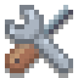
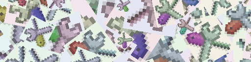

# Mia



> *"Mia is awesome!"*

A lightweight, cross-platform app 'n game engine written in C.

Designed for **pixel art, fast iteration**, and **freedom**.

It runs on desktop, mobile, and the web; Compiles lightning fast. 
And it’s designed to mix **high-level object-oriented structure** with **low-level power** 
— giving you the best of both worlds.

> ⚠️ Mia can be edited, compiled, and run *directly* on an Android device (using CxxDroid).

The object-oriented library tries to prevent common mistakes, but Mia is nevertheless a **C** engine.
So it's expected that you know what you're doing 
— in the sense that you have to think about memory management in more complex scenarios, 
even if the object-tree-based resource management makes it easier.

## Platforms 🖥️📱🌐

Mia currently supports:

- 🖥️ **Desktop** 
  - macOS 
  - Windows
  - Linux (Ubuntu) (also in a headless server mode)
- 📱 **Android**
  - Compilable via [CxxDroid](https://play.google.com/store/apps/details?id=ru.iiec.cxxdroid) *(on-device IDE!)*
  - Native Android app
- 🌐 **WebApp**
  - Mobile-friendly via WebAssembly
  - Also compileable and testable directly on an Android Device using Termux

> 📱 iOS support is planned!

Have a look at the install 'n run docs:
[Install and run Mia](doc/install.md)

> As a note: compiling and testing Mia and its apps on an Android device directly is not just a toy.
> It really makes mobile development a lot easier and fast to iterate on, either for near native with CxxDroid,
> or with the compiling and serving the WebApp via Termux.
>
> Mia tries to be xPlatform in real with: *"write once, test once"*

## Compile Speed ⚡
Mia compiles and links *extremely* fast!
It makes use of unity builds for enormous speedups.
Feels like a scripting language — or even faster!

My Samsung Galaxy S22 Ultra only needs around ~10 s to fully compile the whole engine 
and only a few for single code changes.
An Apple MacAir M3 16GB 512GB compiles all in around a second and single code changes are almost immediately!

## Quick Start ▶️
Open the [examples doc](apps/examples/README.md) to quickly see Mia in action.

The examples also act as a tutorial to read through and are well documented.

> To create your own stuff, use the [apps/hello/main.c](apps/hello/main.c) **Hello World** entry point

## Code Example 📄
Rendering a collage of the mia logo.

> This example is also part of the examples app, see [examples doc](apps/examples/README.md) / "09_upndownload".



```c
oobj img = [..]; // source image for the collage
const int runs = 128;

/**
 * Creates a new empty Texture (RTex) with a size of 512 cols * 128 rows.
 * img is used as a parent
 */
oobj res = RTex_new(img, NULL, 512, 128);

/**
 * Clears the texture to black
 */
RTex_clear_full(res, R_BLACK);

/**
 * Constant sizes
 */
vec2 img_size = RTex_size(img);
vec2 res_size = RTex_size(res);
float img_min_size = m_min(img_size.x, img_size.y);
float res_min_size = m_min(res_size.x, res_size.y);

/**
 * We create a render object that is able to draw the full collage,
 *      batched in a single draw call.
 * It has "runs" quads and the given img as RTex to render
 * This special "new" constructor takes in a tex (RTex) and uses the "color_hsva" shader
 */
oobj ro = RObjQuad_new_tex_color_hsva(res, runs, img, false, 1, 1);

/**
 * Setup each quad.
 * They are rendered on top of each other, so first is rendered first
 */
for(int i=0; i<runs; i++) {

    /**
     * scaling from big (2.0f) to small (0.2f) according to the minimal result size
     */
    float t = (float) i / (float) (runs-1);
    float scale = m_mix(2.0f, 0.2f, t) * res_min_size / img_min_size;

    /**
     * Calc quad stuff like render size, pos and angle to create the pose.
     * pos should be random around the tex center (vec2_scale(res_size, 0.5)) with an amplitude of 66%
     */
    vec2 render_size = vec2_scale(img_size, scale);
    vec2 pos = vec2_random_noise_v(vec2_scale(res_size, 0.5), vec2_scale(res_size, 0.66));
    float angle = m_random() * 2 * m_PI;

    /**
     * Creates a 4x4 3D pose for this quad with the pos as center and a rotation around that
     */
    mat4 pose = u_pose_new_center_angle(m_2(pos), m_2(render_size), angle);

    /**
     * the color hsva shader uses the additional 'fx', 'fy' fields
     * 'fx' would be an override for the rgba color "albedo color"
     * 'fy' is a shift in the hsva color space (hue in this case)
     */
    vec4 hsva_shift = vec4_(m_random(), 0, 0, 0);

    /**
     * Set quad stuff
     */
    struct r_quad *q = o_at(ro, i);
    q->pose = pose;
    q->fy = hsva_shift;
}

/**
 * Batched draw call
 */
RTex_ro(res, ro);

/**
 * Saves the texture as a temporary image file to disk (mia_tmp/collage.png)
 */
RTex_write_file(res, "#collage.png");

/**
 * Deletes the result texture image and all children, like the RObjQuad
 */
o_del(res);
```

## Modules 🔧
Mia is split up into multiple modules, each one having a dependency to the previous.

- **"o"** Object oriented standard library
- **"m"** Math and linear/spatial algebra
- **"s"** Sound stuff
- **"r"** Render stuff working on OpenGL(ES|WEB)
- **"a"** App Scenes, views, and user input
- **"u"** Utilities
- **"w"** Widgets: GUI windows, buttons, input fields
- **"x"** Extended stuff like a virtual keyboard or color picker widget

## Apps 🕹
Mia also comes with integrated (optional) app modules.
An App can also be started as full opaque scene on top of another game or app.

- **"ex"** Examples App
  - Step by step and well documented examples
  - Also includes a standalone [tea timer app](https://horsimann.de/tea) 
  - [Examples doc](apps/examples/README.md)
- **"mp"** Mia Paint
  - Simple pixel art editor app
  - Stand-Alone app configurable in code (canvas size, palette, ...)
  - Or start it as AScene from your own app as an embedded paint tool
    - Let the users draw and edit your game assets
  - State: Work in Progress
  - [Mia Paint doc](apps/MiaPaint/README.md)

## Author
René Horstmann *aka* Horsimann

## License
- The engine and its assets are licensed under MIT, see [LICENSE](LICENSE).
- Uses:
  - [SDL](https://www.libsdl.org/) (zlib License)
  - [Emscripten](https://emscripten.org/) (MIT License)
  - [curl](https://curl.se/docs/copyright.html) (MIT like License)
  - [microtar](https://github.com/rxi/microtar) for handling .tar archive files (MIT License)
  - [miniz](https://github.com/richgel999/miniz) for .zip files and compression (MIT License)
  - [stb_vorbis.c](https://github.com/nothings/stb) to load .ogg sound files (MIT License)
